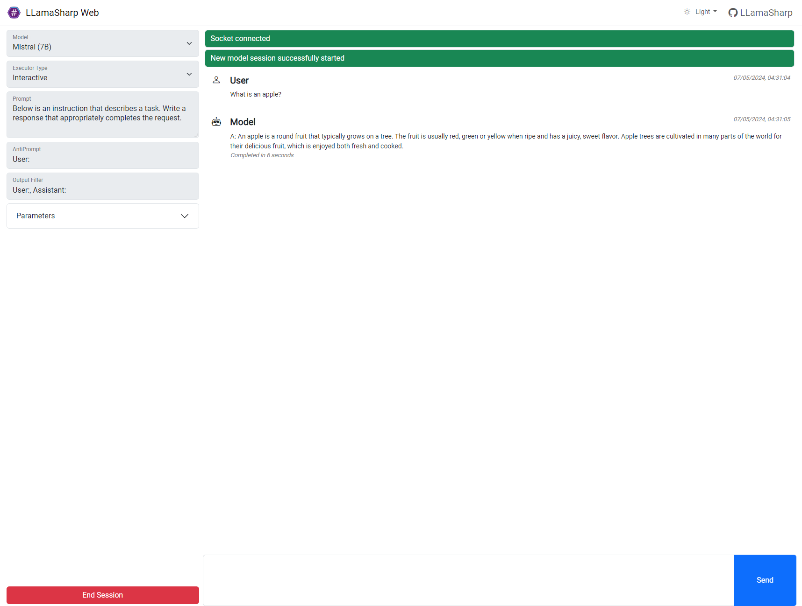
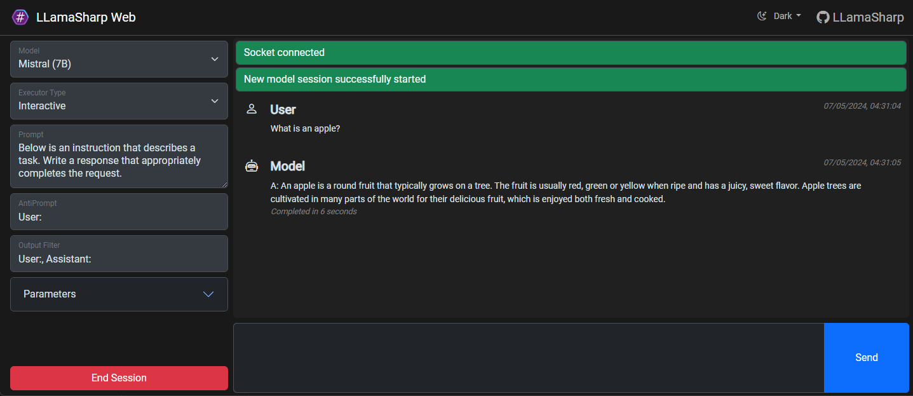

## LLama.Web - Basic ASP.NET Core example of LLamaSharp in action
LLama.Web has no heavy dependencies and no extra frameworks over bootstrap, jquery and mustache to keep the examples clean and easy to copy over to your own project

## Websockets
Using signalr websockets simplifies the streaming of responses and model per connection management

## Setup
Models, Prompts and Inference parameters can be added to `appsettings.json`.
If you would like to add your own local model files then it's best to create an `appSettings.Local.json` file
and add them there.  The `appSettings.Local.json` file will be ignored by Git.

Local assets downloaded at runtime (models in your AppData `LLama.Web/Models`, uploaded files in your AppData `LLama.Web/Uploads`, and offline web libs in `LLama.Web/wwwroot/lib`) are intentionally git-ignored.

To restore offline web assets (markdown/diagram libraries), install LibMan if needed (`dotnet tool install -g Microsoft.Web.LibraryManager.Cli`), ensure the dotnet tools folder is on your PATH (typically `~/.dotnet/tools`), and run LibMan from the `LLama.Web` folder:
```sh
libman restore
```

Attachments uploaded through the web UI are stored under your AppData `LLama.Web/Uploads/<connectionId>` and are cleaned up when the SignalR connection closes.

Model downloads are staged under your AppData `LLama.Web/Downloads` and finalized in AppData `LLama.Web/Models`.

**Models**
You can add multiple models to the options for quick selection in the UI, options are based on ModelParams so its fully configurable.

**Parameters**
You can add multiple sets of inference parameters to the options for quick selection in the UI, options are based on InferenceParams so its fully configurable

**Prompts**
You can add multiple sets of prompts to the options for quick selection in the UI

Example:
```json
 {
        "Name": "Alpaca",
        "Path": "D:\\Repositories\\AI\\Prompts\\alpaca.txt",
        "Prompt": "Alternatively to can set a prompt text directly and omit the Path"
        "AntiPrompt": [
          "User:"
        ],
        "OutputFilter": [
          "Response:",
          "User:"
        ]
  }
```

## Interactive UI
The interactive UI is a simple example of using LLamaSharp.



---


