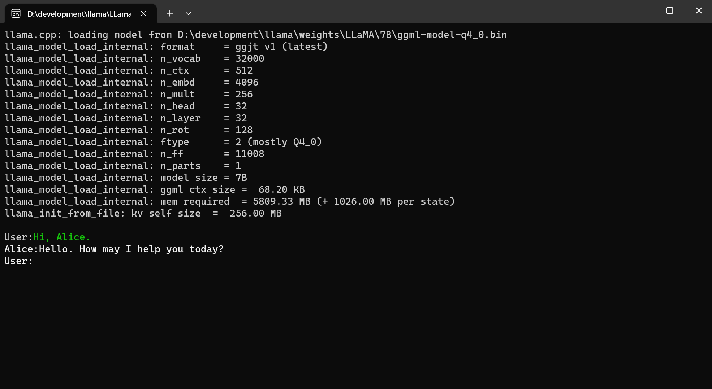



[](https://discord.gg/7wNVU65ZDY)
[](http://qm.qq.com/cgi-bin/qm/qr?_wv=1027&k=sN9VVMwbWjs5L0ATpizKKxOcZdEPMrp8&authKey=RLDw41bLTrEyEgZZi%2FzT4pYk%2BwmEFgFcrhs8ZbkiVY7a4JFckzJefaYNW6Lk4yPX&noverify=0&group_code=985366726)
[](https://www.nuget.org/packages/LLamaSharp)
[](https://www.nuget.org/packages/LLamaSharp.Backend.Cpu)
[](https://www.nuget.org/packages/LLamaSharp.Backend.Cuda11)
[](https://www.nuget.org/packages/LLamaSharp.Backend.Cuda12)
[](https://www.nuget.org/packages/LLamaSharp.semantic-kernel)
[](https://www.nuget.org/packages/LLamaSharp.kernel-memory)


**The C#/.NET binding of [llama.cpp](https://github.com/ggerganov/llama.cpp). It provides higher-level APIs to inference the LLaMA Models and deploy it on local device with C#/.NET. It works on Windows, Linux and Mac without need to compile llama.cpp yourself. Even without a GPU or not enough GPU memory, you can still use LLaMA models! 🤗**

**Furthermore, it provides integrations with other projects such as [semantic-kernel](https://github.com/microsoft/semantic-kernel), [kernel-memory](https://github.com/microsoft/kernel-memory) and [BotSharp](https://github.com/SciSharp/BotSharp) to provide higher-level applications.**

**Discussions about the roadmap to v1.0.0: [#287](https://github.com/SciSharp/LLamaSharp/issues/287)**

<details>
  <summary>Table of Contents</summary>
  <ul>
    <li><a href="#Documentation">Documentation</a></li>
    <li><a href="#Examples">Examples</a></li>
    <li><a href="#Installation">Installation</a></li>
    <li>
      <a href="#(Quick Start)">Quick Start</a>
      <ul>
        <li><a href="#Model Inference and Chat Session">Model Inference and Chat Session</a></li>
        <li><a href="#Quantization">Quantization</a></li>
        <li><a href="#Web API">Web API</a></li>
      </ul>
    </li>
    <li><a href="#Features">Features</a></li>
    <li><a href="#Console Demo">Console Demo</a></li>
    <li><a href="#FAQ">FAQ</a></li>
    <li><a href="#Contributing">Contributing</a></li>
    <li><a href="#Contact us">Contact us</a></li>
    <li>
      <a href="#Appendix">Appendix</a>
      <ul>
        <li><a href="#LLamaSharp and llama.cpp versions">LLamaSharp and llama.cpp versions</a></li>
      </ul>
    </li>
  </ul>
</details>


## Documentation

- [Quick start](https://scisharp.github.io/LLamaSharp/latest/GetStarted/)
- [Tricks for FAQ](https://scisharp.github.io/LLamaSharp/latest/Tricks/)
- [Full documentation](https://scisharp.github.io/LLamaSharp/latest/)
- [API reference](https://scisharp.github.io/LLamaSharp/latest/xmldocs/)

## Examples
- [Official Console Examples](./LLama.Examples/)
- [Unity Demo](https://github.com/eublefar/LLAMASharpUnityDemo)
- [LLamaStack (with WPF and Web support)](https://github.com/saddam213/LLamaStack)


## Installation

1. Install [`LLamaSharp`](https://www.nuget.org/packages/LLamaSharp) package in NuGet:

```
PM> Install-Package LLamaSharp
```

2. Install **one** of these backends:

   - [`LLamaSharp.Backend.Cpu`](https://www.nuget.org/packages/LLamaSharp.Backend.Cpu): Pure CPU for Windows & Linux. Metal for Mac.
   - [`LLamaSharp.Backend.Cuda11`](https://www.nuget.org/packages/LLamaSharp.Backend.Cuda11): CUDA11 for Windows and Linux
   - [`LLamaSharp.Backend.Cuda12`](https://www.nuget.org/packages/LLamaSharp.Backend.Cuda12)@ CUDA 12 for Windows and Linux
   - If none of these backends is suitable you can compile [llama.cpp](https://github.com/ggerganov/llama.cpp) yourself. In this case, please **DO NOT** install the backend packages! Instead, add your DLL to your project and ensure it will be copied to the output directory when compiling your project. If you do this you must use exactly the correct llama.cpp commit, refer to the version table further down.

3. (optional) For [Microsoft semantic-kernel](https://github.com/microsoft/semantic-kernel) integration, install the [LLamaSharp.semantic-kernel](https://www.nuget.org/packages/LLamaSharp.semantic-kernel) package.
4. (optional) For [Microsoft kernel-memory](https://github.com/microsoft/kernel-memory) integration, install the [LLamaSharp.kernel-memory](https://www.nuget.org/packages/LLamaSharp.kernel-memory) package (this package currently only supports `net6.0`).

### Tips for choosing a version

Llama.cpp is a fast moving project with frequent breaking changes, therefore breaking changes are expected frequently in LLamaSharp. LLamaSharp follows [semantic versioning](https://semver.org/) and will not introduce breaking API changes on patch versions.

It is suggested to update to the latest patch version as soon as it is released, and to update to new major versions as soon as possible.

## Quick Start

#### Model Inference and Chat Session

LLamaSharp provides two ways to run inference: `LLamaExecutor` and `ChatSession`. The chat session is a higher-level wrapping of the executor and the model. Here's a simple example to use chat session.

```cs
using LLama.Common;
using LLama;

string modelPath = "<Your model path>"; // change it to your own model path
var prompt = "Transcript of a dialog, where the User interacts with an Assistant named Bob. Bob is helpful, kind, honest, good at writing, and never fails to answer the User's requests immediately and with precision.\r\n\r\nUser: Hello, Bob.\r\nBob: Hello. How may I help you today?\r\nUser: Please tell me the largest city in Europe.\r\nBob: Sure. The largest city in Europe is Moscow, the capital of Russia.\r\nUser:"; // use the "chat-with-bob" prompt here.

// Load a model
var parameters = new ModelParams(modelPath)
{
    ContextSize = 1024,
    Seed = 1337,
    GpuLayerCount = 5
};
using var model = LLamaWeights.LoadFromFile(parameters);

// Initialize a chat session
using var context = model.CreateContext(parameters);
var ex = new InteractiveExecutor(context);
ChatSession session = new ChatSession(ex);

// show the prompt
Console.WriteLine();
Console.Write(prompt);

// run the inference in a loop to chat with LLM
while (prompt != "stop")
{
    await foreach (var text in session.ChatAsync(new ChatHistory.Message(AuthorRole.User, prompt), new InferenceParams { Temperature = 0.6f, AntiPrompts = [ "User:" ] }))
    {
        Console.Write(text);
    }
    prompt = Console.ReadLine() ?? "";
}

// save the session
session.SaveSession("SavedSessionPath");
```

#### Quantization

The following example shows how to quantize the model:

```cs
string srcFilename = "<Your source path>";
string dstFilename = "<Your destination path>";
string ftype = "q4_0";
if(Quantizer.Quantize(srcFileName, dstFilename, ftype))
{
    Console.WriteLine("Quantization succeed!");
}
else
{
    Console.WriteLine("Quantization failed!");
}
```

For more usage, please refer to [Examples](./LLama.Examples).

#### Web API

We provide [an integration with ASP.NET core](./LLama.WebAPI) and a [web app demo](./LLama.Web). Since we are in short of hands, if you're familiar with ASP.NET core, we'll appreciate it if you would like to help upgrading the Web API integration.

## Features

---

✅: completed. ⚠️: outdated for latest release but will be updated. 🔳: not completed

---

✅ LLaMa model inference<br />
✅ Embeddings generation, tokenization and detokenization<br />
✅ Chat session<br />
✅ Quantization<br />
✅ Grammar<br />
✅ State saving and loading<br />
✅ BotSharp Integration [Online Demo](https://victorious-moss-007e11310.4.azurestaticapps.net/)<br />
✅ ASP.NET core Integration<br />
✅ Semantic-kernel Integration<br />
🔳 Fine-tune<br />
✅ Local document search (enabled by kernel-memory)<br />
🔳 MAUI Integration<br />

## Console Demo



## FAQ

1. GPU out of memory: Please try setting `n_gpu_layers` to a smaller number.
2. Unsupported model: `llama.cpp` is under quick development and often has breaking changes. Please check the release date of the model and find a suitable version of LLamaSharp to install, or generate `gguf` format weights from original weights yourself.
3. Cannot load native library:
   - Ensure you have installed one of the backend packages.
   - Run `NativeLibraryConfig.WithLogs()` at the very beginning of your code to print more information.
4. Models in GGUF format are compatible with LLamaSharp. It's a good idea to search for [`gguf` on huggingface](https://huggingface.co/models?search=gguf) to find a model. Another choice is generate a GGUF format file yourself, please refer to [convert.py](https://github.com/ggerganov/llama.cpp/blob/master/convert.py) for more information.


## Contributing

Any contribution is welcomed! There's a TODO list in [LLamaSharp Dev Project](https://github.com/orgs/SciSharp/projects/5) and you could pick an interesting one to start. Please read the [contributing guide](https://scisharp.github.io/LLamaSharp/latest/ContributingGuide/) for more information. 

You can also do one of the followings to help us make LLamaSharp better:

- Submit a feature request.
- Star and share LLamaSharp to let others know it.
- Write a blog or demo about LLamaSharp.
- Help to develop Web API and UI integration.
- Just open an issue about the problem you met!

## Contact us

Join our chat on [Discord](https://discord.gg/7wNVU65ZDY) (please contact Rinne to join the dev channel if you want to be a contributor).

Join [QQ group](http://qm.qq.com/cgi-bin/qm/qr?_wv=1027&k=sN9VVMwbWjs5L0ATpizKKxOcZdEPMrp8&authKey=RLDw41bLTrEyEgZZi%2FzT4pYk%2BwmEFgFcrhs8ZbkiVY7a4JFckzJefaYNW6Lk4yPX&noverify=0&group_code=985366726)

## Appendix

### LLamaSharp and llama.cpp versions
If you want to compile llama.cpp yourself you **must** use the exact commit ID listed for each version.

| LLamaSharp | Verified Model Resources | llama.cpp commit id |
| - | -- | - |
| v0.2.0 | This version is not recommended to use. | - |
| v0.2.1 | [WizardLM](https://huggingface.co/TheBloke/wizardLM-7B-GGML/tree/previous_llama), [Vicuna (filenames with "old")](https://huggingface.co/eachadea/ggml-vicuna-13b-1.1/tree/main) | - |
| v0.2.2, v0.2.3 | [WizardLM](https://huggingface.co/TheBloke/wizardLM-7B-GGML/tree/previous_llama_ggmlv2), [Vicuna (filenames without "old")](https://huggingface.co/eachadea/ggml-vicuna-13b-1.1/tree/main) | `63d2046` |
| v0.3.0, v0.4.0 | [LLamaSharpSamples v0.3.0](https://huggingface.co/AsakusaRinne/LLamaSharpSamples/tree/v0.3.0), [WizardLM](https://huggingface.co/TheBloke/wizardLM-7B-GGML/tree/main) | `7e4ea5b` |
| v0.4.1-preview | [Open llama 3b](https://huggingface.co/SlyEcho/open_llama_3b_ggml), [Open Buddy](https://huggingface.co/OpenBuddy/openbuddy-llama-ggml)| `aacdbd4` |
|v0.4.2-preview | [Llama2 7B (GGML)](https://huggingface.co/TheBloke/llama-2-7B-Guanaco-QLoRA-GGML)| `3323112` |
| v0.5.1 | [Llama2 7B (GGUF)](https://huggingface.co/TheBloke/llama-2-7B-Guanaco-QLoRA-GGUF)| `6b73ef1` |
| v0.6.0 | | [`cb33f43`](https://github.com/ggerganov/llama.cpp/commit/cb33f43a2a9f5a5a5f8d290dd97c625d9ba97a2f) |
| v0.7.0, v0.8.0 | [Thespis-13B](https://huggingface.co/TheBloke/Thespis-13B-v0.5-GGUF/tree/main?not-for-all-audiences=true), [LLaMA2-7B](https://huggingface.co/TheBloke/llama-2-7B-Guanaco-QLoRA-GGUF) | [`207b519`](https://github.com/ggerganov/llama.cpp/commit/207b51900e15cc7f89763a3bb1c565fe11cbb45d) |
| v0.8.1 | | [`e937066`](https://github.com/ggerganov/llama.cpp/commit/e937066420b79a757bf80e9836eb12b88420a218) |
| v0.9.0, v0.9.1 | [Mixtral-8x7B](https://huggingface.co/TheBloke/Mixtral-8x7B-v0.1-GGUF) | [`9fb13f9`](https://github.com/ggerganov/llama.cpp/blob/9fb13f95840c722ad419f390dc8a9c86080a3700) |
| v0.10.0 | [Phi2](https://huggingface.co/TheBloke/phi-2-GGUF) | [`d71ac90`](https://github.com/ggerganov/llama.cpp/tree/d71ac90985854b0905e1abba778e407e17f9f887) |

## License

This project is licensed under the terms of the MIT license.
