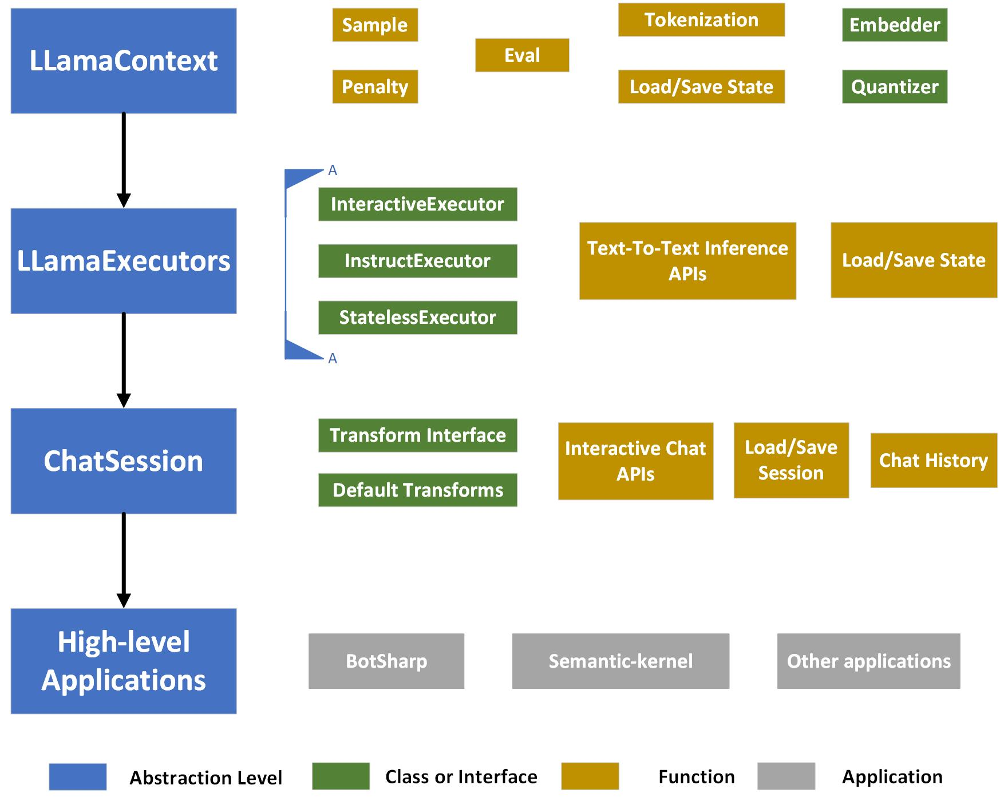

# Architecture

## Architecture of main functions

The figure below shows the core framework structure of LLamaSharp.

- **Native APIs**: LLamaSharp calls the exported C APIs to load and run the model. The APIs defined in LLamaSharp specially for calling C APIs are named `Native APIs`. We have made all the native APIs public under namespace `LLama.Native`. However, it's strongly recommended not to use them unless you know what you are doing.
- **LLamaWeights**: The holder of the model weight.
- **LLamaContext**: A context which directly interact with the native library and provide some basic APIs such as tokenization and embedding. It takes use of `LLamaWeights`.
- **LLamaExecutors**: Executors which define the way to run the LLama model. It provides text-to-text and image-to-text APIs to make it easy to use. Currently we provide four kinds of executors: `InteractiveExecutor`, `InstructExecutor`, `StatelessExecutor` and `BatchedExecutor`. 
- **ChatSession**: A wrapping for `InteractiveExecutor` and `LLamaContext`, which supports interactive tasks and saving/re-loading sessions. It also provides a flexible way to customize the text process by `IHistoryTransform`, `ITextTransform` and `ITextStreamTransform`.
- **Integrations**: Integrations with other libraries to expand the application of LLamaSharp. For example, if you want to do RAG ([Retrieval Augmented Generation](https://en.wikipedia.org/wiki/Prompt_engineering#Retrieval-augmented_generation)), kernel-memory integration is a good option for you.

